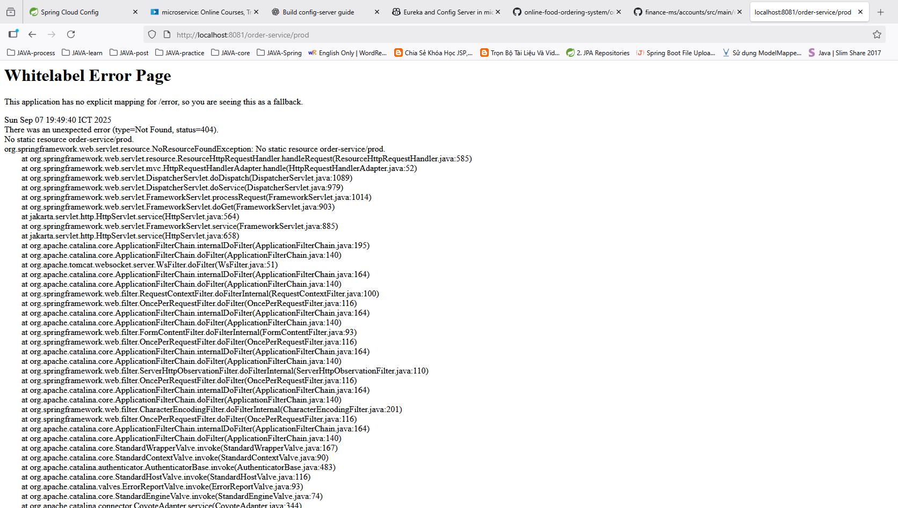
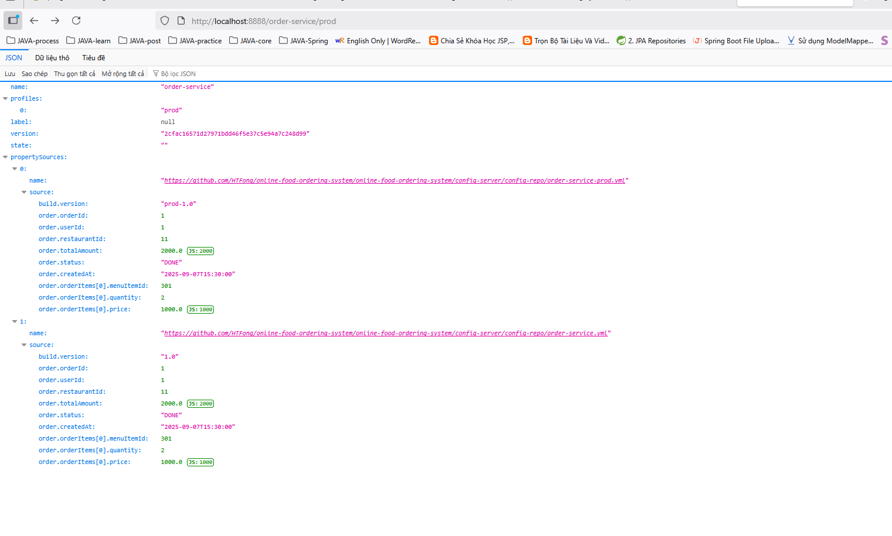

complete build config-server and order-service
want to load profile prod or native but its not work. why?
call config OK: http://localhost:8888/order-service/prod
call from order NG: http://localhost:8081/order-service/prod